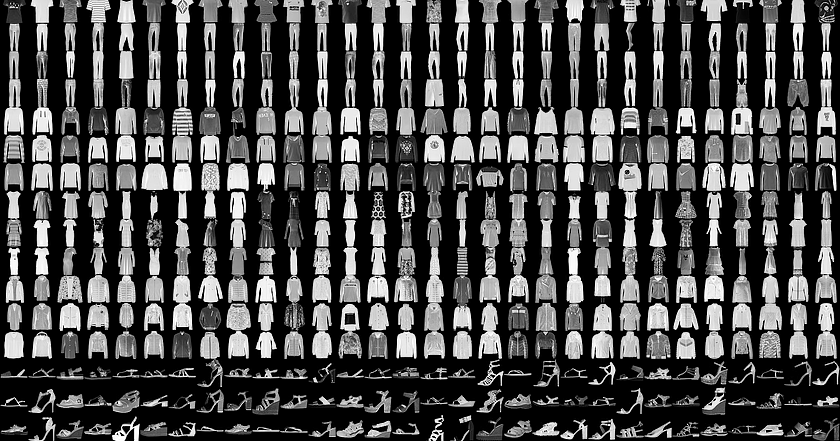

# Fashion-MNIST-PyTorch
Pytorch implementation of Gray Image Classification 

**Dataset:**
[Fashin MNIST](https://www.kaggle.com/datasets/zalando-research/fashionmnist)
Fashion-MNIST is a set of 28x28 grayscale images of clothes. A dataset which contains 70,000 grayscale images in 10 categories

