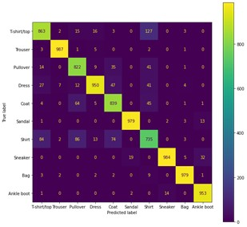
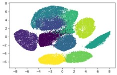

# Fashion-MNIST-PyTorch
Pytorch implementation of Gray Image Classification 


**Dataset:**
[Fashion MNIST](https://www.kaggle.com/datasets/zalando-research/fashionmnist)
is a set of 28x28 grayscale images of clothes.  
A dataset which contains 70,000 grayscale images in 10 categories  
  
**Clasess:**    
- T-shirt/top
- Trouser
- Pullover
- Dress
- Coat
- Sandal
- Shirt
- Sneaker
- Bag
- Ankle boot  

Set | #Train | #Validation | #Test |
--- | --- | --- | --- |
#images | 48K | 12K | 10K |  

**Installations**  
```pip install torch, torchvision, tensorflow, sklearn```
**3 Layer simple DNN Results:**  
   

**2 Layer CNN + BN + MaxPool + L2 Regularization + 30% Drop-out Results:**  
    
**TSNE on Train and Test (128 Latent feature vectors)**  
   
